<!-- README.md is generated from README.Rmd. Please edit that file -->

# ggiplot

<!-- badges: start -->
<!-- badges: end -->

This package provides a **ggplot2** equivalent of the base
[`fixest::iplot()`](https://lrberge.github.io/fixest/reference/coefplot.html)
function.

[`Installation`](#installation) \| [`Examples`](#examples) \|
[`License`](#license)

## Installation

Install from [GitHub](https://github.com/):

``` r
# install.packages("remotes")
remotes::install_github("grantmcdermott/ggiplot")
```

## Examples

Here follow some examples that draw on the **fixest** [introductory
vignette](https://lrberge.github.io/fixest/articles/fixest_walkthrough.html),
as well as the `iplot()` help documentation.

As we’ll see, the package essentially consists of a single function —
**`ggiplot()`** — that tries to closely mimic it base compatriot.
However, by leveraging the **ggplot2** API and infrastructure, it also
offers some additional functionality.

Start by loading the **ggiplot** package alongside **fixest**.

``` r
library(ggiplot)
library(fixest)
```

### Example 1: Vanilla TWFE

``` r
data(base_did)
base_inter = base_did

est_did = feols(y ~ x1 + i(period, treat, 5) | id+period, base_inter)
```

Let’s compare the (base) `iplot` and `ggiplot` default plots.

``` r
iplot(est_did)
```

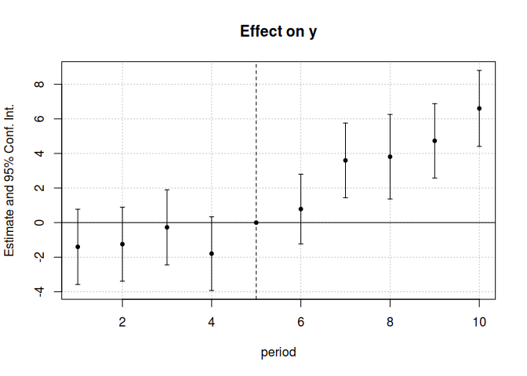

``` r
ggiplot(est_did)
```

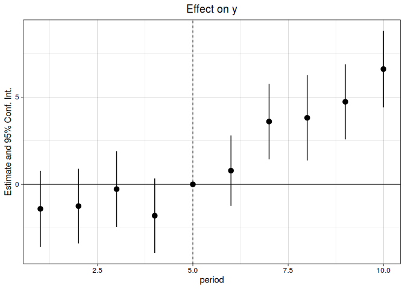

There are some small differences, but they are certainly producing the
same basic plot. To get even closer to the original, we could specify
the use of errorbar(s) rather than (`ggiplot`’s default of)
pointrange(s).

``` r
ggiplot(est_did, geom = 'errorbar')
```

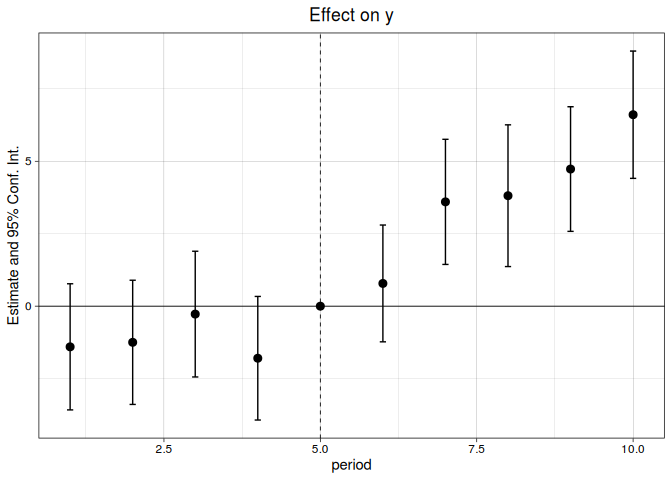

Many of the arguments for `iplot()` carry over to `ggiplot()` too. This
is deliberate, since we want to reduce the cognitive overhead of
switching between the two plotting methods. For example, we can join
points using the same `pt.join = TRUE` argument.

``` r
iplot(est_did, pt.join = TRUE)
```

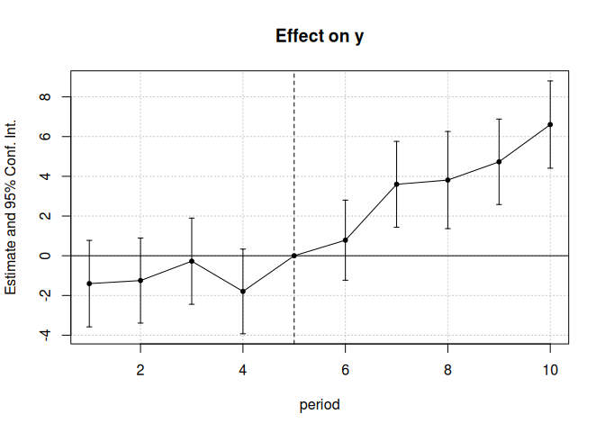

``` r
ggiplot(est_did, pt.join = TRUE, geom_style = 'errorbar')
```

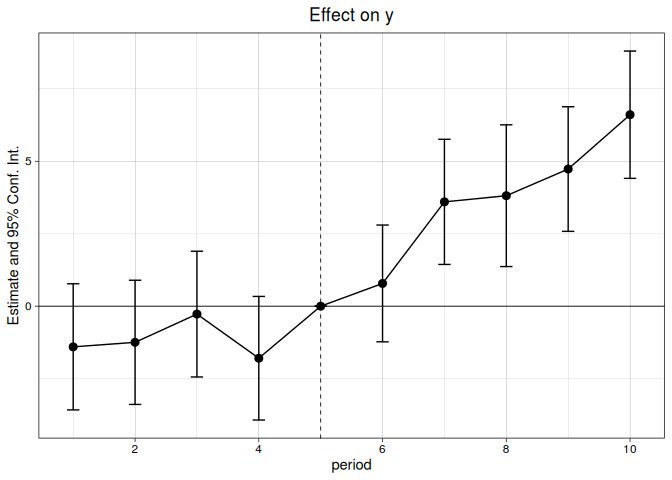

The `ggiplot` defaults are slightly different in some cases, but may
require less arguments depending on what you want to do. For example,

``` r
# iplot(est_did, pt.join = TRUE, ci.lty = 0, ci.width = 0, ci.fill = TRUE)
iplot(est_did, pt.join = TRUE, ci.lty = 0, ci.width = 0, ci.fill = TRUE,
      ci.fill.par = list(col = 'black', alpha = 0.4))
```

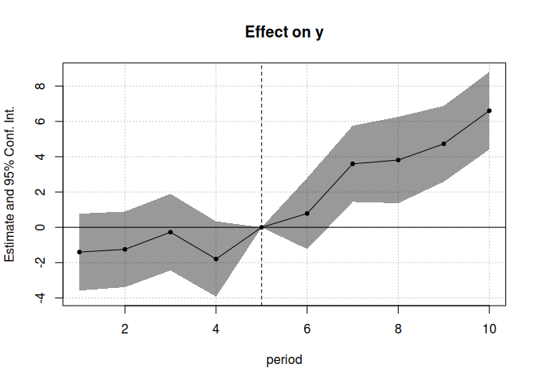

``` r
ggiplot(est_did, geom_style = 'ribbon')
```

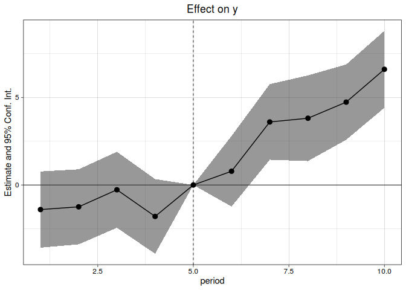

``` r
ggiplot(est_did, geom_style = 'ribbon', pt.pch = NA, col = 'orange')
#> Scale for 'colour' is already present. Adding another scale for 'colour',
#> which will replace the existing scale.
```

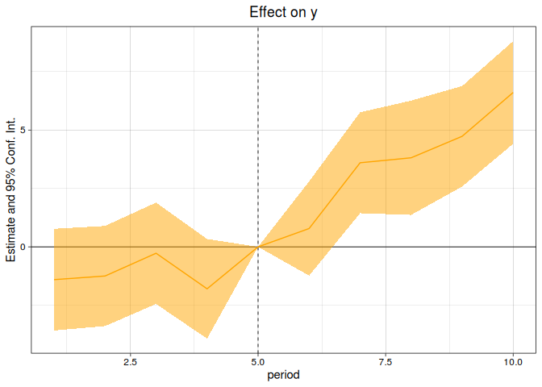

### Example 2: Multiple estimation (i)

We’ll demonstrate using the staggered treatment example from the
**fixest** introductory vignette.

``` r
data(base_stagg)
est_twfe = feols(y ~ x1 + i(time_to_treatment, treated, ref = c(-1, -1000)) | 
                                    id + year, base_stagg)
est_sa20 = feols(y ~ x1 + sunab(year_treated, year) | 
                                    id + year, base_stagg)
```

Again, for comparison, here the base `iplot` original. Note that we add
the legend manually.

``` r
iplot(list('TWFE' = est_twfe, 'Sun & Abraham (2020)' = est_sa20),
      main = 'Staggered treatment', ref.line = -1, pt.join = TRUE)
legend('topleft', col = c(1, 2), pch = c(20, 17),
              legend = c('TWFE', 'Sun & Abraham (2020)'))
```

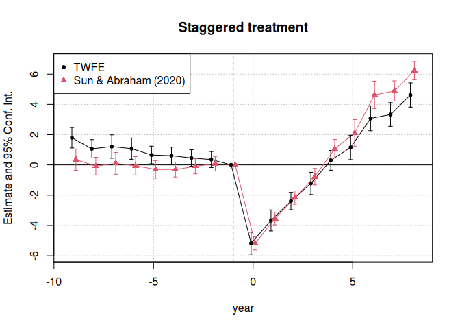

Here’s the `ggiplot` version.

``` r
ggiplot(list('TWFE' = est_twfe, 'Sun & Abraham (2020)' = est_sa20),
        main = 'Staggered treatment', ref.line = -1, pt.join = TRUE)
```

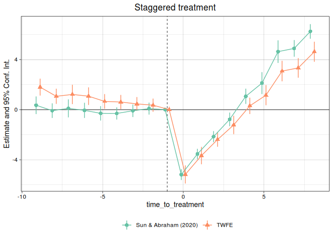

If we don’t name out list of models then it defaults to something
sensible.

``` r
ggiplot(list(est_twfe, est_sa20),
        main = 'Staggered treatment', ref.line = -1, pt.join = TRUE)
```

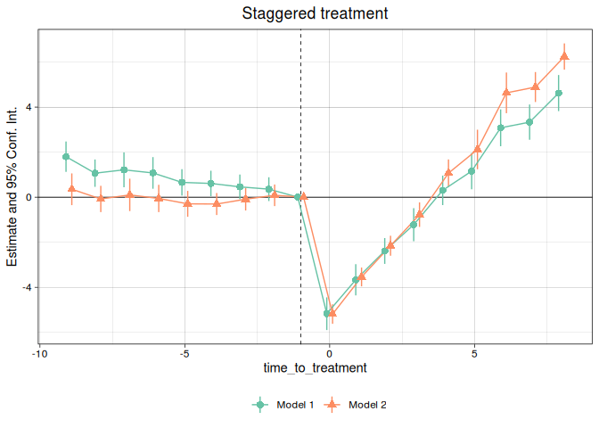

One nice thing about the **ggplot2** API is that it makes changing
multiplot figures simple. For example, if you don’t like the
presentation of “dodged” models in a single frame, then it’s easy to
facet them instead using the `multi_style = 'facet'` argument.

``` r
ggiplot(list('TWFE' = est_twfe, 'Sun & Abraham (2020)' = est_sa20),
        main = 'Staggered treatment', ref.line = -1, pt.join = TRUE,
        multi_style = 'facet')
```


### Example 3: Multiple estimation (ii)

An area where `ggiplot` shines is in complex multiple estimation cases,
such as lists of `fixest_multi` objects. To illustrate, let’s add a
split variable (group) to our staggered dataset.

``` r
base_stagg_grp = base_stagg
base_stagg_grp$grp = ifelse(base_stagg_grp$id %% 2 == 0, 'Evens', 'Odds')
```

Now re-run our two regressions from earlier, but splitting the sample to
generate `fixest_multi` objects.

``` r
est_twfe_grp = feols(y ~ x1 + i(time_to_treatment, treated, ref = c(-1, -1000)) | 
                                            id + year, base_stagg_grp, 
                                         split = ~ grp)
est_sa20_grp = feols(y ~ x1 + sunab(year_treated, year) | 
                                            id + year, base_stagg_grp, 
                                         split = ~ grp)
```

Both `iplot` and `ggiplot` do fine with a single `fixest_multi` object
(although remember that we have to manually add a legend for the former)

``` r
iplot(est_twfe_grp, ref.line = -1, main = 'Staggered treatment: TWFE')
legend('topleft', col = c(1, 2), pch = c(20, 17),
              legend = c('Evens', 'Odds'))
```


``` r
ggiplot(est_twfe_grp, ref.line = -1, main = 'Staggered treatment: TWFE')
```


However, `iplot` complains if we combine a list of *several*
`fixest_multi` objects.

``` r
iplot(list('TWFE' = est_twfe_grp, 'Sun & Abraham (2020)' = est_sa20_grp),
      ref.line = -1, main = 'Staggered treatment: Split mutli-sample')
#> Error in coefplot_prms(object = object, ..., sd = sd, ci_low = ci_low, : The first element of 'object' raises and error:
#> Error in coeftable(object = my__object__) : 
#>   Sorry, the coeffficients table could not be extracted.
```

In contrast, `ggiplot` works…

``` r
ggiplot(list('TWFE' = est_twfe_grp, 'Sun & Abraham (2020)' = est_sa20_grp),
        ref.line = -1, main = 'Staggered treatment: Split mutli-sample')
```

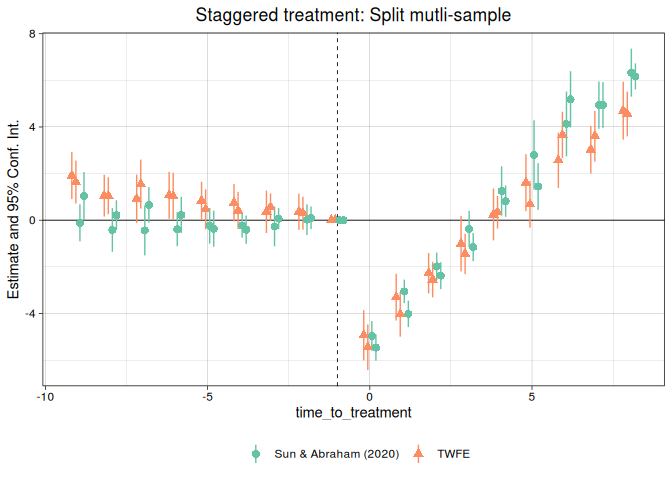

… but is even better when we use faceting instead of dodged errorbars.
Let’s use this an opportunity to construct a fancy plot that invokes
some additional arguments and ggplot theming.

``` r
ggiplot(list('TWFE' = est_twfe_grp, 'Sun & Abraham (2020)' = est_sa20_grp),
        ref.line = -1,
        main = 'Staggered treatment: Split mutli-sample',
        xlab = 'Time to treatment',
        multi_style = 'facet',
        geom_style = 'ribbon',
        theme = theme_minimal() +
           theme(text = element_text(family = 'HersheySans'),
                 plot.title = element_text(hjust = 0.5),
                 legend.position = 'none'))
```

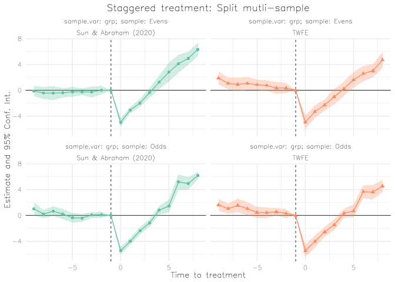

### Asides

#### On theming and scale adjustments

Setting the theme inside the `ggiplot()` call is optional and not
strictly necessary, since the ggplot2 API allows programmatic updating
of existing plots. E.g.

``` r
last_plot() + labs(caption = 'Note: Super fancy plot brought to you by ggiplot')
```

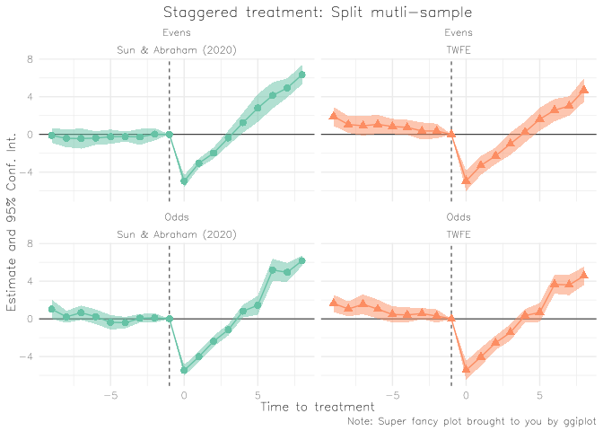

``` r
last_plot() + 
    theme_grey() + 
    theme(legend.position = 'none') +
    scale_colour_brewer(palette = 'Set1', aesthetics = c('colour', 'fill'))
#> Scale for 'colour' is already present. Adding another scale for 'colour',
#> which will replace the existing scale.
```

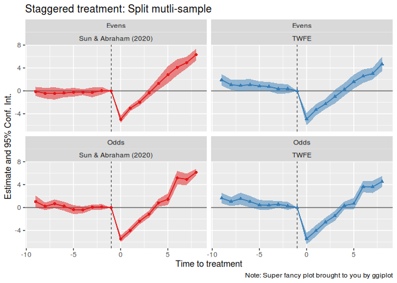

etc.

#### On dictionaries

Dictionaries work similarly to `iplot`. Simple example:

``` r
base_inter$letter = letters[base_inter$period]
est_letters = feols(y ~ x1 + i(letter, treat, 'e') | id+letter, base_inter)

# Dictionary for capitalising the letters
dict = LETTERS[1:10]; names(dict) = letters[1:10]

ggiplot(est_letters) # No dictionary
```

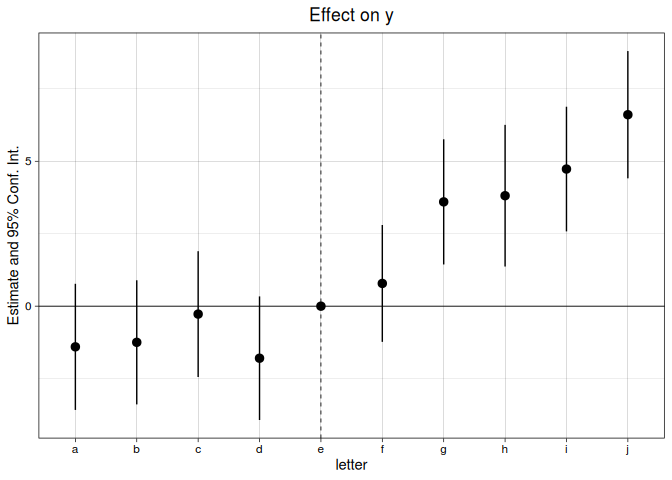

You can either set the dictionary directly in the plot call…

``` r
ggiplot(est_letters, dict = dict)
```


… Or, set it globally using the `setFixest_dict()` macro.

``` r
setFixest_dict(dict)
ggiplot(est_letters)
```


``` r
setFixest_dict() # reset
```

## License

The material in this repository is made available under the [MIT
license](http://opensource.org/licenses/mit-license.php).
