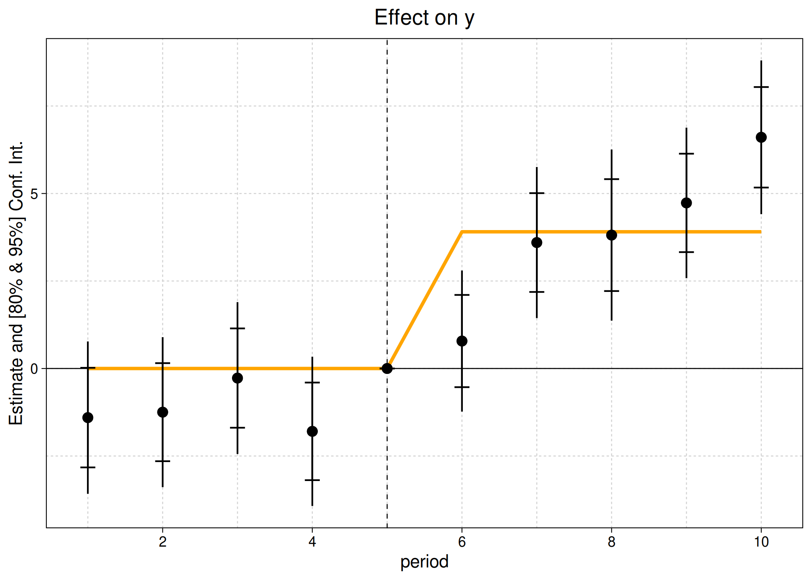

<!-- README.md is generated from README.Rmd. Please edit that file -->

# ggiplot

<!-- badges: start -->

[](https://grantmcdermott.com/ggiplot/index.html)
<!-- badges: end -->

This package provides a **ggplot2** equivalent of the base
[`fixest::iplot()`](https://lrberge.github.io/fixest/reference/coefplot.html)
function. The primary goal of the package is to produce nice looking
event study plots.

## Installation

Install from [GitHub](https://github.com/):

``` r
# install.packages("remotes")
remotes::install_github("grantmcdermott/ggiplot")
```

## Quickstart

A detailed [introductory
vignette](http://grantmcdermott.com/ggiplot/articles/ggiplot.html) with
many examples is provided on the package homepage (or, by typing
`vignette("ggiplot")` in your R console). But here are a few quickstart
examples to whet your appetite. First, a basic event study plot.

``` r
library(ggiplot)
library(fixest)

est_did = feols(y ~ x1 + i(period, treat, 5) | id+period, base_did)

# iplot(est_did) ## base version
ggiplot(est_did) ## this package
```


The above plot call and output should look very familiar to regular
**fixest** users. But note that `ggiplot()` supports several features
that are not available in the base `iplot()` version. For example,
plotting multiple confidence intervals and aggregate treatments effects.

``` r
ggiplot(
    est_did,
    ci_level = c(.8, .95),
    aggr_eff = "post", aggr_eff.par = list(col = "orange")
    )
```



And you can get quite fancy, combining lists of complex multiple
estimation objects with custom themes, and so on.

``` r
base_stagg_grp = base_stagg
base_stagg_grp$grp = ifelse(base_stagg_grp$id %% 2 == 0, 'Evens', 'Odds')

est_twfe_grp = feols(
    y ~ x1 + i(time_to_treatment, treated, ref = c(-1, -1000)) | id + year,
    data = base_stagg_grp, split = ~grp
    )

est_sa20_grp = feols(
    y ~ x1 + sunab(year_treated, year) | id + year, 
    data = base_stagg_grp, split = ~grp
    )

ggiplot(list('TWFE' = est_twfe_grp, 'Sun & Abraham (2020)' = est_sa20_grp),
        ref.line = -1,
        main = 'Staggered treatment: Split mutli-sample',
        xlab = 'Time to treatment',
        multi_style = 'facet',
        geom_style = 'ribbon',
        theme = theme_minimal() +
                    theme(
                        text = element_text(family = 'HersheySans'),
                        plot.title = element_text(hjust = 0.5),
                        legend.position = 'none'
                        )
                )
```


## License

The material in this repository is made available under the [MIT
license](http://opensource.org/licenses/mit-license.php).
