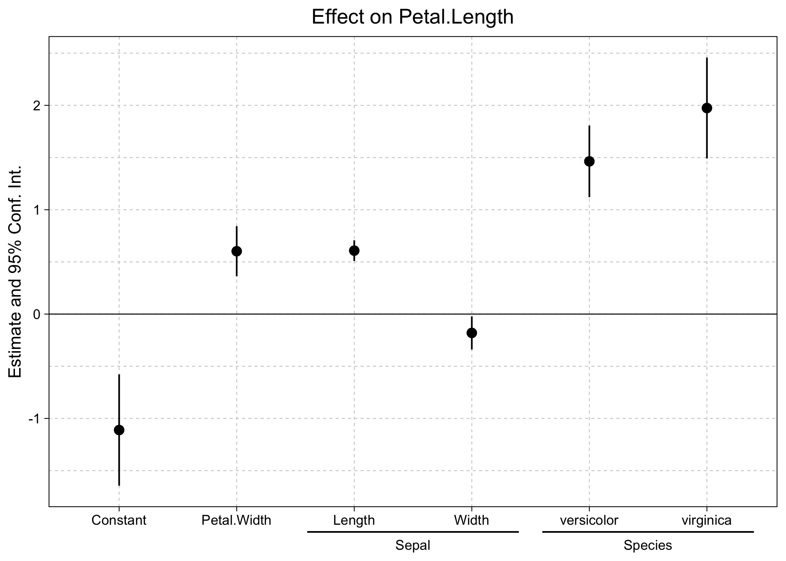

<!-- README.md is generated from README.Rmd. Please edit that file -->

# ggiplot

<!-- badges: start -->

[](https://grantmcdermott.r-universe.dev)
[](https://grantmcdermott.com/ggiplot/index.html)
[](https://github.com/grantmcdermott/ggiplot/actions/workflows/R-CMD-check.yaml)
<!-- badges: end -->

This package provides **ggplot2** equivalents of the (base)
[`fixest::coefplot`](https://lrberge.github.io/fixest/reference/coefplot.html)
and
[`fixest::iplot`](https://lrberge.github.io/fixest/reference/coefplot.html)
functions. The goal of **ggiplot** is to produce nice coefficient and
interaction plots (including [event
study](https://theeffectbook.net/ch-EventStudies.html) plots) with
minimal effort, but with lots of scope for further customization.

## Installation

The package is not yet on CRAN, but can be installed from R-universe:

``` r
install.packages("ggiplot", repos = "https://grantmcdermott.r-universe.dev")
```

## Quickstart

The \[package website\]([introductory
vignette](http://grantmcdermott.com/ggiplot) provides a number of
examples in the help documentation. (Also available by typing
`?ggcoefplot` or `?ggiplot` in your R console.) But here are a few
quickstart examples to whet your appetite.

Start by loading the **ggiplot** and **fixest** packages. Note that
**ggiplot** *only* supports **fixest** model objects, so the latter must
be loaded alongside the former.

``` r
library(fixest)
library(ggiplot)
```

### Coefficient plots

Use `ggcoefplot` to draw basic coefficient plots.

``` r
est = feols(
  Petal.Length ~ Petal.Width + Sepal.Length + Sepal.Width + Species, 
  data = iris
)

# coefplot(est) ## base version
ggcoefplot(est) ## this package
```


The above plot call and output should look very familiar to regular
**fixest** users. Like its base equivalent, `ggcoefplot` can be heavily
customized and contains various shortcuts for common operations. For
example, we can use regex the control the coefficient grouping logic.

``` r
ggcoefplot(est, group = list(Sepal = "^^Sepal.", Species = "^^Species"))
```



### Event study plots

The `ggiplot` function is a special case of `ggocoefplot` that only
plots coefficients with factor levels or interactions (specifically,
those created with the
[`i()`](https://lrberge.github.io/fixest/reference/i.html) operator).
This is especially useful for producing event study plots in a
difference-in-differences (DiD) setup.

``` r
est_did = feols(y ~ x1 + i(period, treat, 5) | id+period, base_did)

# iplot(est_did) ## base version
ggiplot(est_did) ## this package
```


Again, the above plot call and output should look very familiar to
regular **fixest** users. But note that `ggiplot` supports several
features that are not available in the base `iplot` version. For
example, plotting multiple confidence intervals and aggregate treatments
effects.

``` r
ggiplot(
    est_did,
    ci_level = c(.8, .95),
    aggr_eff = "post", aggr_eff.par = list(col = "orange")
)
```


And you can get quite fancy, combining lists of complex multiple
estimation objects with custom themes, and so on.

``` r
base_stagg_grp = base_stagg
base_stagg_grp$grp = ifelse(base_stagg_grp$id %% 2 == 0, 'Evens', 'Odds')

est_twfe_grp = feols(
    y ~ x1 + i(time_to_treatment, treated, ref = c(-1, -1000)) | id + year,
    data = base_stagg_grp, split = ~grp
)

est_sa20_grp = feols(
    y ~ x1 + sunab(year_treated, year) | id + year,
    data = base_stagg_grp, split = ~grp
)

ggiplot(
    list("TWFE" = est_twfe_grp, "Sun & Abraham (2020)" = est_sa20_grp),
    ref.line = -1,
    main = "Staggered treatment: Split mutli-sample",
    xlab = "Time to treatment",
    multi_style = "facet",
    geom_style = "ribbon",
    facet_args = list(labeller = labeller(id = \(x) gsub(".*: ", "", x))),
    theme = theme_minimal() +
        theme(
            text = element_text(family = "HersheySans"),
            plot.title = element_text(hjust = 0.5),
            legend.position = "none"
        )
)
```


For more `ggiplot` examples and comparisons with its base counterpart,
see the detailed
[vignette](http://grantmcdermott.com/ggiplot/articles/ggiplot.html) on
the package homepage (or, by typing `vignette("ggiplot")` in your R
console).
